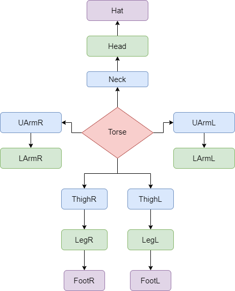
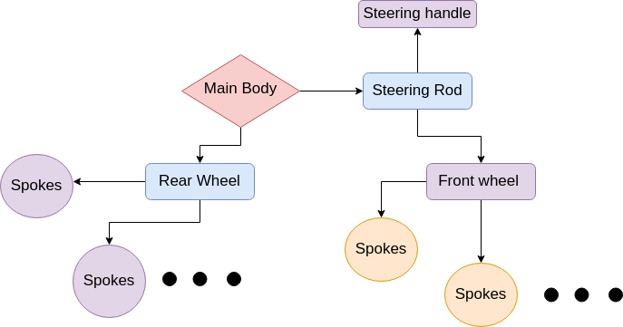
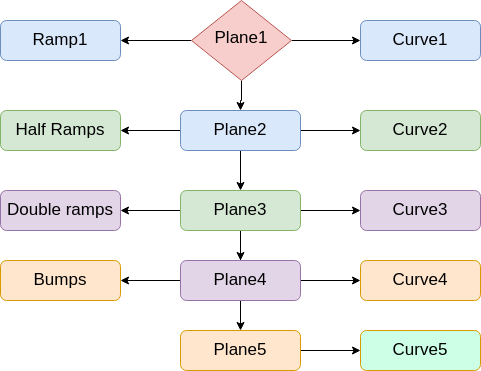

# CS475 : Assignment 2(Modelling FMX)
### By Harsh Shah(200050049), Neeraj Jadhav(200050086)

## Hierarchy of models
### Rider

### Bike

### Track

# Key bindings :  
## Global rotation
The keys W, A, S, D, Q, E have been used for global rotation. Pressing these
keys change the respective Euler angles as described below. The entire model, even
if rider, bike and track are present, gets rotated using these keys.
Let θx, θy, θz be the Euler angles then
1. W : Decreases θx
2. S : Increases θx
3. A : Decreases θy
4. D : Increases θy
5. Q : Decreases θz
6. E : Increases θz

## Global Translation
The keys 2, 4, 6, 8, 5 have been used for global translation. They function as given
below. The translation caused by pressing these keys is with respect to the rotated
axes (caused by doing global rotation as described in the previous section). Note
that these keys translate only the currently selected object. Details on selecting an
object have been provided in the Miscellaneous section.
1. 8 : Move towards +Y
2. 2 : Move towards -Y
3. 6 : Move towards +X
4. 4 : Move towards -X
5. 5 : Move towards +Z
6. Shift + 5 : Move towards -Z

## Local rotations
The keys Up, Down, Right, Left, PgUp PgDown have been used for local
rotations. For the rider, they work as follows :
1. Up, Down : Bend forwards or backwards
2. Right, Left : Turn right or left
3. PgUp, PgDown : Bend right or left
For the bike, they work as follows :
1. PgUp, PgDown : Bend forwards or backwards
2. Right, Left : Turn right or left
3. Up, Down : Bend right or left
Similarly for the track, along its axes

## Bike’s movements
1. Pressing F and Shift + F rotates the front tire 
2. Pressing R and Shift + R rotates the rear tire
3. Pressing T and Shift + T steers the bike.

## Selecting Parts
### Rider
First press C to active Rider part selection mode and then give input via the
terminal for part selection.
1. a : Select the torso
2. b : Select the left upper arm
3. c : Select the left lower arm
4. d : Select the right upper arm
5. e : Select the right lower arm
6. f : Select the left thigh
7. g : Select the left leg
8. h : Select the right thigh
9. i : Select the right leg
10. j : Select the neck
11. k : Select the head
### Bike
Pressing V selects the bike.
### Track
Pressing X selects the track.
Pressing Z selects all objects.
## Scaling the objects
Pressing M and Shift + M scales up and down the selected object respectively.

# Undertaking
We, Harsh Shah and Neeraj Jadhav, swear on river styx, that we have not copied the code for assignment 2 present in the repository, nor have we indulged in any kind of plagiarism. We have coded all the scripts by ourselves.
